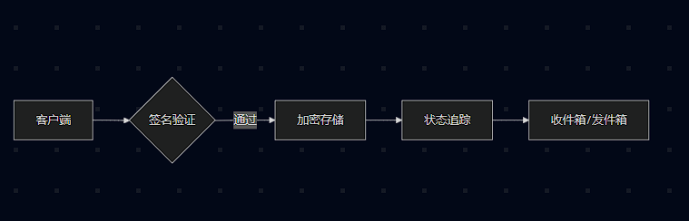
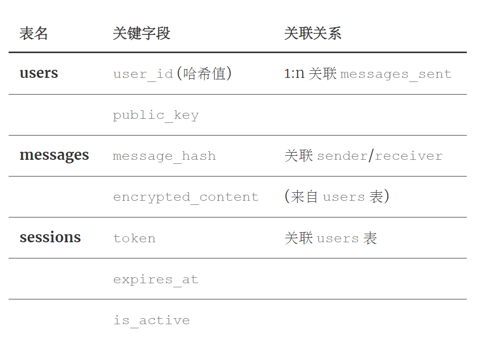

1. 核心模块结构
server/
├── app.py          # 应用初始化与全局配置
├── config.py       # 多环境配置管理
├── run.py          # 工厂模式应用创建
├── auth.py         # 用户认证蓝图模块
├── messages.py     # 消息业务蓝图模块
└── models.py       # 数据库模型定义

2. 关键技术实现
- 安全认证机制 ：
  
  - 基于JWT的令牌认证（有效期1天）
  - 会话管理系统（Session表跟踪活跃会话）
  - 数字签名验证（RSA算法保障消息完整性）
- 消息处理流程 ：
    

3. 数据库设计 

外键关联users.id 4. 运维配置
- 多环境支持（开发/测试/生产）
- 请求速率限制（200次/天，50次/小时）
- 自动清理过期会话
- 数据库迁移脚本集成
